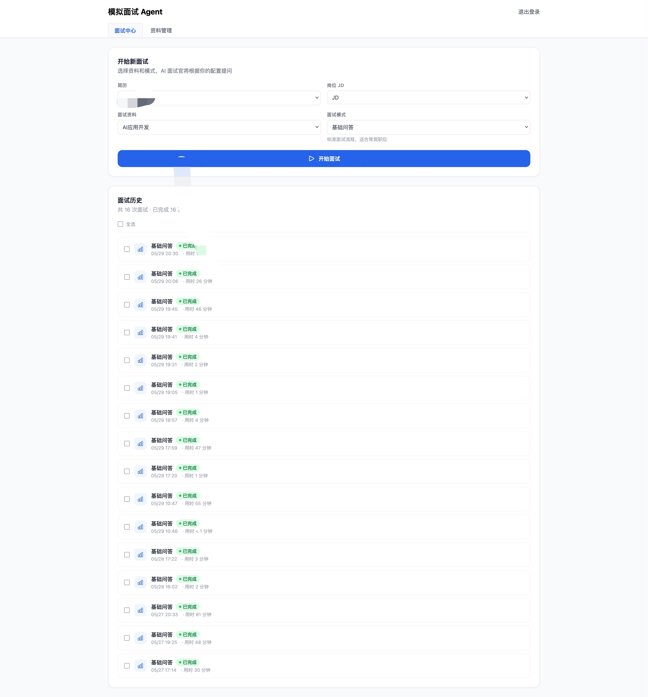
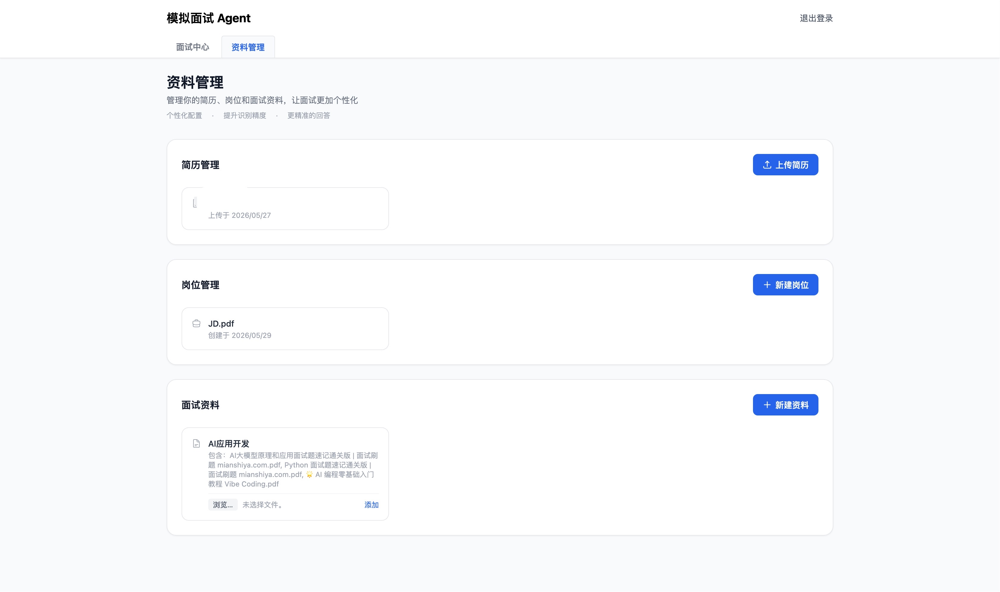
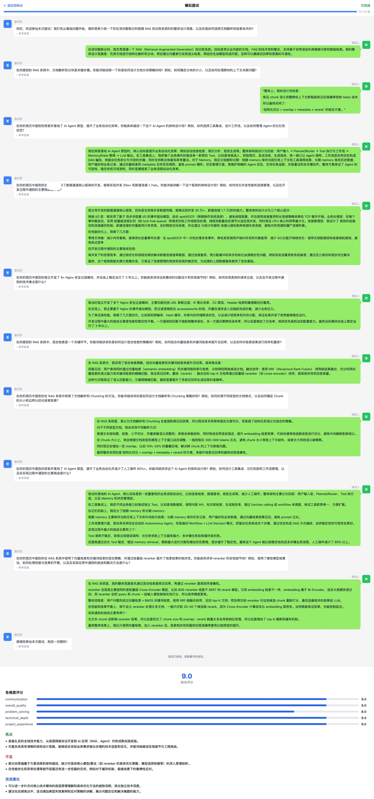

# 🎯 Interview Agent — AI 模拟面试练习工具

> 上传简历 + JD，让 AI 面试官针对你的经历出题、追问、评分，帮你在真实面试前找到自己的短板。


---

## ✨ 功能特性

- **定制化出题**：根据你的简历和目标 JD 智能生成面试问题，不是死板题库
- **流式对话**：面试官逐字打字回复，体验接近真实面试节奏
- **追问机制**：根据你的回答决定是深挖还是换话题，模拟真实面试官行为
- **学习模式**：每道题可查看参考答案，答完即学
- **实时评分**：每轮回答后给出得分和简短反馈
- **完整报告**：面试结束后生成技术深度、沟通表达、项目经验等多维度评估报告
- **历史记录**：所有面试记录可回顾，追踪进步轨迹
- **题库管理**：支持上传自定义题库，结合向量检索精准匹配

---

## 🖥️ 界面预览

**面试中心** — 配置简历、JD、面试模式，查看历史记录



**资料管理** — 上传简历、岗位 JD、面试参考资料



**面试对话**



---

## 🛠️ 技术栈

| 层级 | 技术 |
|------|------|
| 后端 | FastAPI + LangGraph + LangChain |
| 前端 | Next.js 14 + TypeScript + Tailwind CSS |
| 数据库 | PostgreSQL (pgvector) |
| 向量库 | Qdrant |
| 文件存储 | MinIO |
| 任务队列 | Celery + Redis |
| LLM | DeepSeek API（可换成任意 OpenAI 兼容接口） |
| 可观测性 | LangFuse v2（可选） |

---

## 🚀 本地部署

### 前置要求

- Docker & Docker Compose
- DeepSeek API Key（[申请地址](https://platform.deepseek.com/)，新用户有免费额度）

### 1. 克隆项目

```bash
git clone https://github.com/yangyinmiao/interview-agent.git
cd interview-agent
```

### 2. 配置环境变量

```bash
cp .env.example .env
```

编辑 `.env`，填入以下必填项：

```env
# DeepSeek API（必填）
DEEPSEEK_API_KEY=sk-xxxxxxxxxxxxxxxx

# JWT 密钥，随机字符串即可
SECRET_KEY=your-random-secret-key-here

# 数据库密码（可保持默认）
PG_PASSWORD=agent123

# MinIO 密码（可保持默认）
MINIO_USER=minioadmin
MINIO_PASSWORD=minioadmin
```

### 3. 启动服务

```bash
docker compose up -d
```

首次启动会拉取镜像并构建，约需 3-5 分钟。

### 4. 初始化数据库

```bash
docker compose exec backend alembic -c alembic.ini upgrade head
```

### 5. 打开浏览器

访问 http://localhost:3000，注册账号即可开始使用。

---

## 📖 使用流程

1. **注册/登录** → 进入控制台
2. **上传简历**（PDF/Word）→ 系统自动解析
3. **上传目标 JD**（可选，提升出题精准度）
4. **创建面试** → 选择简历、JD、面试模式
5. **开始作答** → 像真实面试一样回答问题
6. **查看报告** → 面试结束后获取完整评估

---

## 🔧 可选：LangFuse 可观测性

项目已集成 LangFuse v2，可监控每次 LLM 调用的 token 用量、延迟和完整调用链。

```bash
# 启动 LangFuse（已包含在 docker-compose.yml 中）
docker compose up -d langfuse

# 访问 http://localhost:3001
# 默认账号：admin@local.dev / admin123
```

在 `.env` 中填入 LangFuse 的 Public Key 和 Secret Key 即可自动上报。

---

## 🤝 贡献

欢迎 PR 和 Issue！

如果这个项目对你有帮助，请点个 ⭐ 支持一下。

---

## 📄 License

MIT
